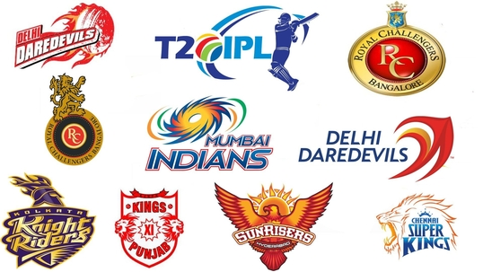
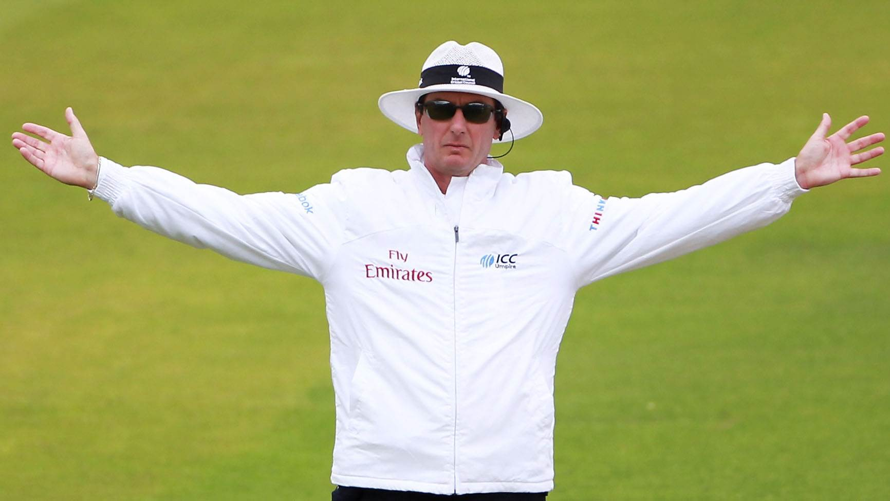

# IPL First Innings Score Predictor - Deployment
* In this repository all files are added which are required for the deployment of the webapp.
* If you want to view the deployed model, click on the following link here :https://first-innings-score-predictor.herokuapp.com/
# overview of the project:
* created a machine learning model for predicting the first inning score of IPL matches.
* optimized features
* data cleaning 
* feature engineering
* Exploratory Data Analysis
# Resources used:
Packages: pandas, numpy, sklearn, matplotlib, seaborn,pickle,heroku.
# Dataset:
* 617 IPL matches -> data/ipl.csv
### The data set consists of the following columns
* mid -> Each match is given a unique number
* date -> When the match happened
* venue -> Stadium where match is being played
* bat_team -> Batting team name
* bowl_team -> Bowling team name
* batsman -> Batsman name who faced that ball
* bowler -> Bowler who bowled that ball
* runs -> Total runs scored by team at that instance
* wickets -> Total wickets fallen at that instance
* overs -> Total overs bowled at that instance
* runs_last_6 -> Total runs scored in last 6 overs
* wickets_last_6 -> Total wickets that fell in last 6 overs
* striker -> max(runs scored by striker, runs scored by non-striker)
* non-striker -> min(runs scored by striker, runs scored by non-striker)
* total -> Total runs scored by batting team after first innings

# Algorithims used:
Linear regression, Decision Tree, Random Forest
among these linear_regresion performed well ,so that was taken into the consideration.

#  Features and Label Used
* features:{date,venue,bat_team,bowl_team,runs,wickets,overs,runs_last_6, wickets_last_6}
* label:{ total}

# The End

##### My gratitude to Krish Sir for his guidance through his youtube channel 🙌.
##### My gratitude to Anuj vyas sir for providing his open source repository which helped me of getting a basic idea and motivated me off doing  this project🙌.  

